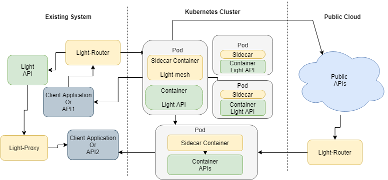
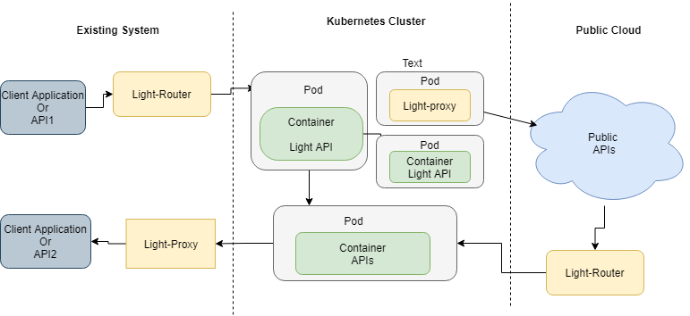

## http-sidecar:   

http-sidecar can be deployed as sidecar container run in parallel with the main container in the pod. 

The http-sidecar sidecar service will handle proxy and router the ingress/egress traffic for the service in main container, and can delegate the Cross-Cutting Concerns handlers for the service in main container. 

 
  - http-sidecar
  
    http-sidecar can be deployed as sidecar container/service to handle restful request/response related functionalities which include:
     
     - Package and deployed as separate module to handle Cross-Cutting Concerns for main container/service in the same pod. In this case, the main service only need care about the http request/response and business logic
     
     - Ingress traffic: client API request will come to sidecar service first, sidecar service act as a proxy to delegate light client features, which include, openapi schema validation, observability, monitoring, logging, JWT verify, etc. Then forward the request to main service.
      
     - Egress traffic: main service call sidecar service first for egress traffic; in this case, sidecar service act as a router to delegate light client features, which include service discovery, SSL handshake, JWT token management, etc. Then forward the request to server API.


### Architecture diagram

- Deploy the service with sidecar container:



- Service normal deployment without sidecar container:




### What Is a Sidecar Pattern

Segregating the functionalities of an application into a separate process can be viewed as a Sidecar pattern. The sidecar design pattern allows you to add a number of capabilities to your application without additional configuration code for third-party components.

In software architecture a sidecar attach to a parent application and extends/enhances its functionalities. A sidecar is loosely coupled with the main application.

In Kubernetes cluster environment, sidecar can be deployed as Sidecar container run in parallel with the main container in the pod.  


### Benefits of Using a Sidecar Pattern:

- Reduces the complexity in the microservice code by abstracting the common infrastructure-related functionalities to a different layer.
- Reduces code duplication in a microservice architecture since you do not need to write configuration code inside each microservice.
- Provide loose coupling between application code and the underlying platform.


### start http-sidecar locally and verify:

- start http-sidecar service

```
cd ~/workspace
git clone git@github.com:networknt/light-mesh.git

cd light-mesh

mvn clean install

cd http-sidecar

java -jar -Dlight-4j-config-dir=config/local  target/http-sidecar.jar


```

The http-sidecar service will start on http port 9080 and https port 9445. In the kubernetes multiple containers situation, the http-sidecar service will be deployed as sidecar container with the service API in same pod.
The service API could use any technologies, like NodeJs, .nets, php service...; The sidecar container (http-sidecar service) will handle the ingress and egress traffic to the pod and leverage light-4j cross-cutting concerns and client module features.

In the k8s pod, the egress network traffic will http protocol(from service API container to sidecar container), and the traffic will be forwarded by sidecar container (delegate light-router features) to downsteam API.

In reverse way, the ingress traffic (from outside of pod to call the service API in the pod) should be https protocol, it will reach the sidecar container first (by http-sidecar service Id), the sidecar container will leverage the light platform cross-cutting concerns features and forward the request to main service container in the pod.


- Start Nodejs restful API (It is simulate the service in the Pod) 

Follow the [steps](nodeapp/start.md) to start Nodejs books store restful API. The Nodejs api will start on local port: 8080 

We can verify the Nodejs restful API directly with curl command:

```
Get:

curl --location --request GET 'http://localhost:8080/api/books/' \
--header 'Content-Type: application/json' \
--data-raw '{"name":"mybook"}'

Post:

curl --location --request POST 'http://localhost:8080/api/books/' \
--header 'Content-Type: application/json' \
--data-raw '{"title":"Newbook"}'

Put:

curl --location --request POST 'http://localhost:8080/api/books/' \
--header 'Content-Type: application/json' \
--data-raw '{"title":"Newbook"}'

Delete:

curl --location --request DELETE 'http://localhost:8080/api/books/4' \
--header 'Content-Type: application/json' \
```


- Start a sample light-4j API from light-example-4j (It is simulate the outside service which service in the Pod need to call):


```
 cd ~/networknt
 git clone git@github.com:networknt/light-example-4j.git
 cd ~/networknt/light-example-4j/servicemesher/services

 mvn clean install -Prelease

cd petstore-service-api

java -jar target/petstore-service-api-3.0.1.jar

```

The petstore light-api will start on local https 8443 port. 


- Try the call by using http-sidecar:

#### Egress traffic (http protocol, port 9080)

Send request from service in the pod to light API petstore through sidecar

```
curl --location --request GET 'http://localhost:9080/v1/pets' \
--header 'Content-Type: application/json' \
--data-raw '{"accountId":1,"transactioType":"DEPOSIT","amount":20}'
```

#### Ingress traffic (https protocol, port 9445)

Send request from outside service to the service in the pod through sidecar

```
curl --location --request GET 'https://localhost:9445/api/books/' \
--header 'Content-Type: application/json' \
--data-raw '{"name":"mybook"}'
```

Leverage schema validation handler cross-cutting concerns

```
curl --location --request POST 'https://localhost:9445/api/books/' \
--header 'Content-Type: application/json' \
--data-raw '{"author":"Steve Jobs"}'
```

response:

```
{
    "statusCode": 400,
    "code": "ERR11004",
    "message": "VALIDATOR_SCHEMA",
    "description": "Schema Validation Error - requestBody.title: is missing but it is required",
    "severity": "ERROR"
}
```


